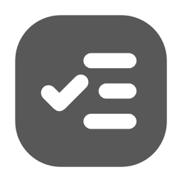
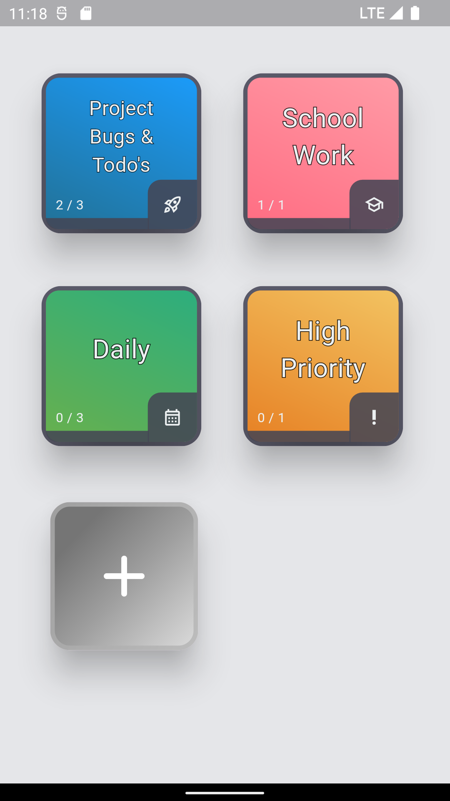
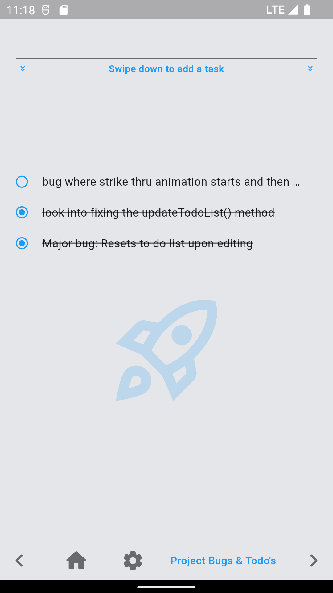
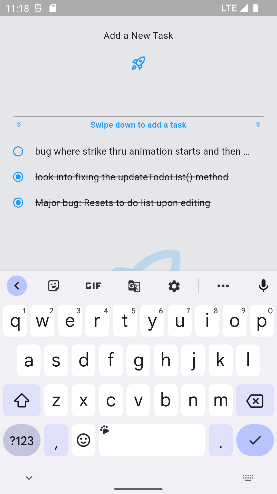
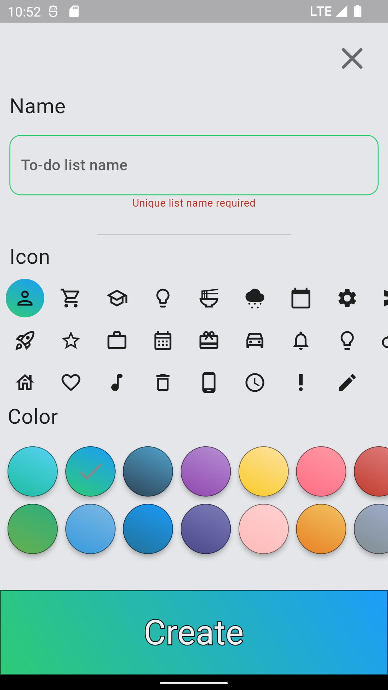

<!-- PROJECT LOGO -->
 

  

  <h3 align="center">Simple Task</h3>

  

    The simple way to manage your to-do lists!
     
     
  

 

  [![Flutter][Flutter]][Flutter-url]
  [![Dart][Dart]][Dart-url]
  

 

<!-- ABOUT THE PROJECT -->
## About The Project

The goal of this app is to provide a simple and intuitive user experience that allows users to easily manage their tasks. The interface is minimal and clean, with a focus on functionality rather than flashy graphics. Key features are easily accessible, with a clear and consistent layout across all screens. The app also provides helpful feedback to users, such as confirming when a task has been added or deleted. Finally, the app is designed to be responsive and work well on both desktop and mobile devices

 

  
  
    
  
  
  
  
   

(<a href="#readme-top">back to top</a>)

## UX Brief

<strong>User Flow</strong>
 
*The app is easy to navigate and use, with a clear and logical flow for creating, editing, and completing tasks.*
<ul> 
<li>Home screen allows you jump to a todo list</li>
<li>Swipe to navigate across your todo lists </li>
<li>Swipe down on the to do list to enter a new task </li>
<li>Swipe across a task to cross it out </li>
<li>Create a new list by tapping '+' or swiping to the end </li>
</ul>

<strong>Visual Design</strong>
 
*The app should have a clean and minimalist design, with a consistent color pallette, icons, & typography.*
<ul> 
<li>Function over form- A clear hierarchy of information that makes it easy for users to quickly identify and interact with key features </li>
<li>Customize lists with Colors & Icons </li>
<li>Incorporate subtle animations to enhance the overall user experience</li>
<li> Avoid any unnecessary visual noise or complexity that could detract from the user experience. </li>
</ul>

<!-- LICENSE -->
## License

Distributed under the MIT License. See `LICENSE.txt` for more information.

(<a href="#readme-top">back to top</a>)

<!-- CONTACT -->
## Contact

Walid Harkous- [@github](https://github.com/SimpleLogix) - harkouswalid@gmail.com

Project Link: [SimpleTask](https://github.com/SimpleLogix/SimpleTask)

(<a href="#readme-top">back to top</a>)

<!-- MARKDOWN LINKS & IMAGES -->
<!-- https://www.markdownguide.org/basic-syntax/#reference-style-links -->

[Flutter]: https://img.shields.io/badge/Flutter-02569B?style=for-the-badge&logo=flutter&logoColor=white
[Flutter-url]: https://flutter.dev/
[Dart]: https://img.shields.io/badge/Dart-0175C2?style=for-the-badge&logo=dart&logoColor=white
[Dart-url]: https://dart.dev/
